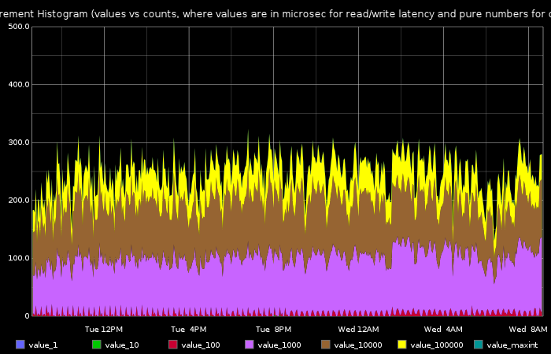
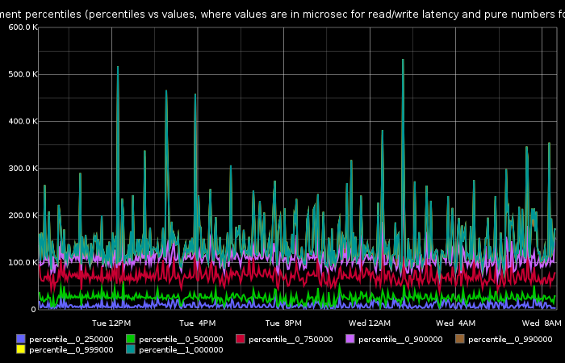

# Cassandra cfhistogram reporter
This tool analyzes the output of cassandra's "nodetool cfhistogram" and sends metrics to a metric backend such as graphite. 

The tool analyzes the following information per node/keyspace/column family:
 * Row sizes
 * Column counts
 * Read/write latency (microsec)
 * Number of sstable accesses per read/write

The tool performs an analysis on the data before sending the metric data to the metric backend. This is due to the fact that the amount of raw data that cfhistogram generates is huge and usually has too much unneeded data. The tool allows the user to select how to bucketize the raw data, and which percentiles are really important. Only the selected buckets and percentiles will generate metric data.

In the future, this tool will expand to other cassandra metrics.

### Example Graphs using Graphite and Graphitus

### Installation
The simplest way is to run the tool periodically (e.g. minutely through cron) from each of the cassandra nodes in the cluster. This is easy if you have some kind of configuration management tool such as chef or puppet. If deploying it to all the cassandra nodes is hard, then you can run it in a remote mode by providing a cassandra host list using the `-H` parameter. The only requirement when run this way is that nodetool will be available in the machine running cfhistogram-reporter. The easiest way to do that is to just run it on one of the cassandra nodes.

In order to perform autodiscovery of keyspaces/column families, the tool requires  to be installed. Just install it using pip install, or specify the list of keyspaces/column families manually in the parameters. See the `-k` and `-c` parameters.

### Usage
Here is an example command line running the tool:

	./cfhistogram-reporter -k ALL -c ALL -H `hostname` -p 8080 -C graphite -P server=graphitehost,port=2003 -n cassandra.cfhistogram.data -b 1,10,100,1000,10000,100000 -r 0.25,0.5,0.75,0.9,0.99,0.999,1 -B blacklisted_keyspace1

When running from each cassandra node, it will send metric data for all keyspaces and their matching column families. The metrics will be sent to a graphite server called graphitehost. The data will be analyzed to provide a histogram of the values 1,10,100... Also, the percentiles that will be calculated are the ones according to the -r parameter. In addition, "blacklisted_keyspace1" will be excluded if it exists.

Here is the full usage information for the tool:

	Usage: cfhistogram-reporter [options]

	Options:
	  -h, --help            show this help message and exit
	  -k KEYSPACES, --keyspaces=KEYSPACES
				Keyspace name. Can be ALL if pycassa is installed
	  -c COLUMN_FAMILIES, --column-family=COLUMN_FAMILIES
				column family list. Can be ALL if pycassa is installed
	  -H HOST_LIST, --host-list=HOST_LIST
				list of hosts
	  -p PORT, --port=PORT  nodetool port (actually JMX port, same for all hosts)
	  -A API_PORT, --api-port=API_PORT
				Cassandra API port (not the JMX port). Required only
				if using ALL for keyspace or column families
	  -C METRIC_CLIENT_TYPE, --metric-client-type=METRIC_CLIENT_TYPE
				Type of metric client. currently supported types are
				'stdout' and 'graphite'. The 'graphite' type requires
				the following client params (-P): 'host=X,port=Y'
	  -P METRIC_CLIENT_PARAMS, --metric-client-params=METRIC_CLIENT_PARAMS
				Comma separated list of parameters in the format x=y.
				Will be passed to the metric client
	  -n METRIC_NAME_PREFIX, --metric-name-prefix=METRIC_NAME_PREFIX
				Prefix for all metrics. You can add ${HOSTNAME} in the
				prefix and it will be replaced with 'domain.hostname'.
				E.g. data.hadoop.jobtracker.${HOSTNAME} . Note that
				you'd need to use single quotes in the command line so
				the $ sign will not be parsed by the shell
	  -L, --local-mode      Activate local mode (logging to console)
	  -l LOG_FILE_LOCATION, --log-file-location=LOG_FILE_LOCATION
				full filename location of log file, default is under a
				logs/ folder in the executable's folder
	  -b BUCKET_VALUE_LIST, --bucket-value-list=BUCKET_VALUE_LIST
				List of bucket values
	  -r REQUIRED_PERCENTILES_LIST, --required-percentiles-list=REQUIRED_PERCENTILES_LIST
				List of percentile values, floating point style - e.g.
				0.95, 0.1 etc
	  -B BLACKLISTED_KEYSPACES, --blacklisted-keyspaces=BLACKLISTED_KEYSPACES
				Comma separated list of blacklisted keyspaces

### Parameters
Parameters related to keyspaces/column families to report on:
 * `-k` - A list of keyspaces. Can be set to ALL in order to scan all keyspaces (ALL requires  to be installed)
 * `-c` - A list of column families. Can be set to ALL in order to scan all column families in each of the provided keyspaces (ALL requires  to be installed)

Connectivity Parameters:
 * `-H` - List of cassandra node names. If the tool is run from each of the cassandra nodes, just set this parameter to the node's hostname, using back-ticked the hostname linux command
 * `-p` - The nodetool port (It's actually the cassandra JMX port). This must be the same port for all cassandra nodes
 * `-A` - Cassandra API port (not the JMX port). Defaults to 9160. Required only if using pycassa and the ALL keyspace/column family

Metric backend parameters:
 * `-C` - Type of metric client. Currently supported metric clients are `graphite` and `stdout`
 * `-P` - Specific parameters for metric client. The graphite metric client require "server=X,port=Y" as parameters. The stdout metric client doesn't require parameters.
 * `-n` - The prefix of the metrics that will be generated.

Analysis Parameters:
 * `-b` - A comma separated list of bucket values. For example: 1,10,100,1000,10000
 * `-r` - The list of required percentiles to calculate. For example: 0.25,0.5,0.99,0.999,1.0

Execution Parameters:
 * `-L` - Local mode. Output will be sent to stdout instead of a log file
 * `-l` - Manual log file location. If this parameter is not set, a logs/ folder will be automatically created below the tool's location, and a log file will be created there.

## Contact
Any feedback would be much appreciated, as well as pull requests, of course.

Harel Ben-Attia, harelba@gmail.com, @harelba on Twitter

